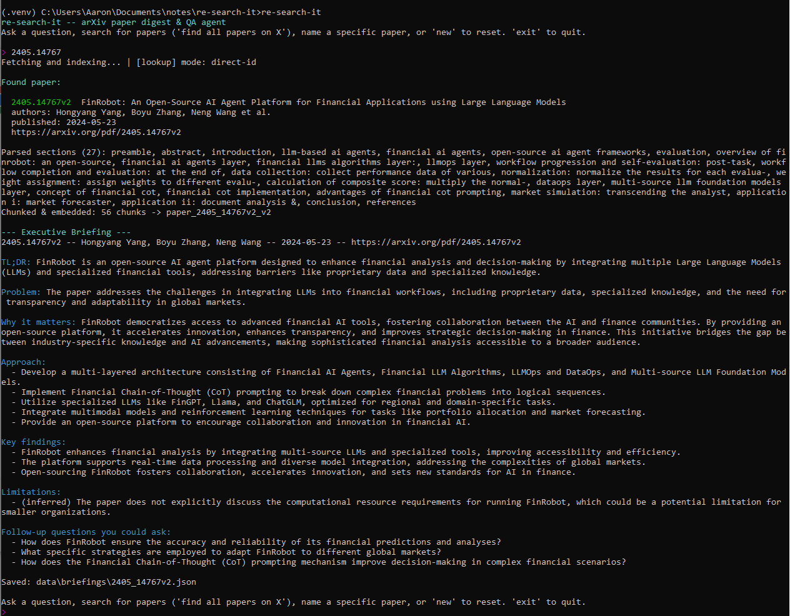
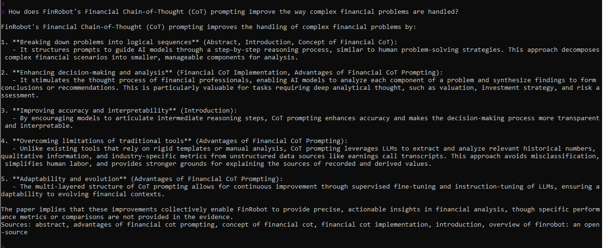
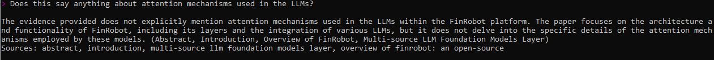
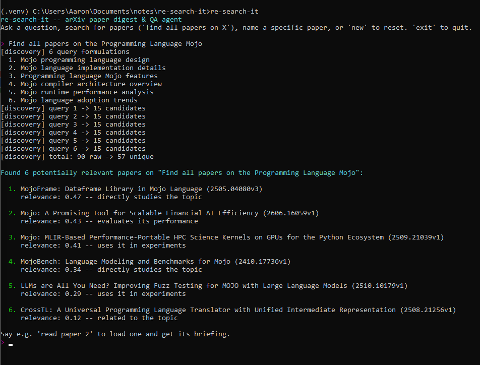
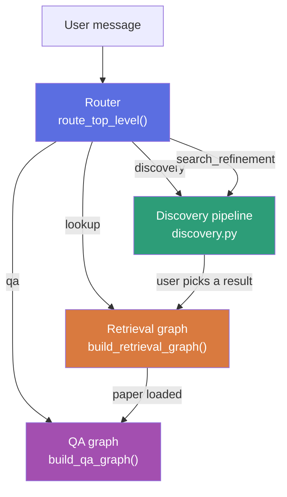
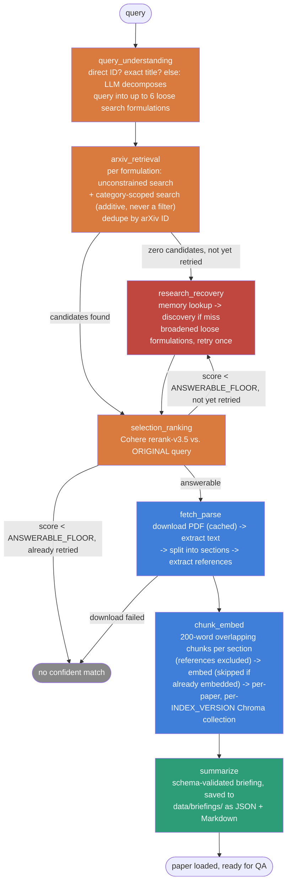
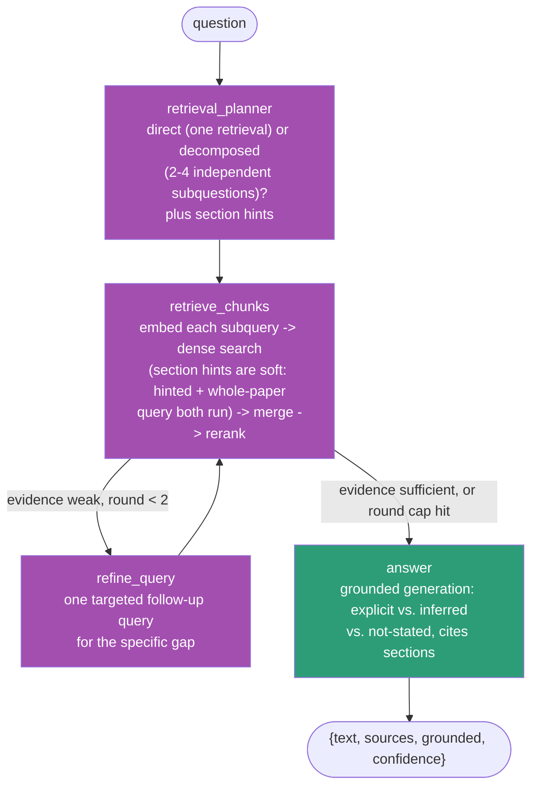
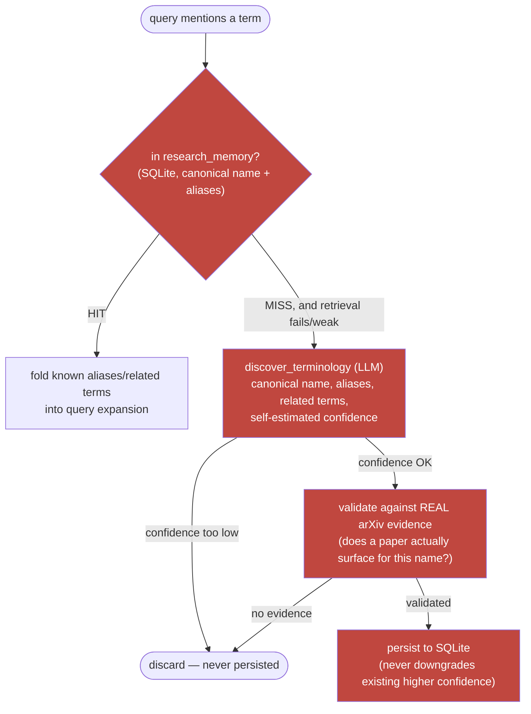

# re-search-it
An Autonomous arXiv Paper Digest and QA Agent

Give it a topic, a title, or an arXiv ID. It finds the paper, writes a structured briefing, and answers questions using only the paper's own text — and says so when the paper doesn't cover something. Ask about many papers instead of one, and it switches to discovery mode: a ranked candidate list instead of a single paper.

Built as explicit LangGraph state graphs — not a single monolithic prompt.

**Demo video:** https://www.loom.com/share/a899e15c19174f88a8763d059bc4397c

## Sample output

| Direct lookup (arXiv ID) | Grounded QA — success (in context) |
|---|---|
|  |  |

| Grounded QA — refusal (out of context) | Indirect (topic) lookup |
|---|---|
|  |  |

## Setup

```bash
python -m venv .venv
.venv\Scripts\activate      # Windows
source .venv/bin/activate   # macOS/Linux
pip install -r requirements.txt
pip install -e .            # registers the `re-search-it` CLI command
cp .env.example .env        # then fill in your API keys
```

Get a free trial key at dashboard.cohere.com and put it in `.env` as `COHERE_API`. Trial keys are rate-limited.

## Usage

```bash
re-search-it
```

One prompt, three things you can do:

```
> find all papers about diffusion models for video generation      (discovery)
> Attention is all you need                                        (lookup — title, ID, or topic)
> what does this paper say about their evaluation setup?           (qa — once a paper is loaded)
```

`new` resets the session, `exit`/`quit` leaves.

## Example run

A text transcript of one real session (built from actual logged pipeline output — the QA excerpts below are real answers from a live `eval/run_eval.py` run, not hand-written; see `eval.md` for the full run these are drawn from). No screenshot/GIF capture is available in this environment, so this is the text version only.

```
> Attention is all you need
Found paper:
  1706.03762  Attention Is All You Need
  authors: Ashish Vaswani, Noam Shazeer, Niki Parmar et al.
  https://arxiv.org/pdf/1706.03762v7

Parsed sections (24): preamble, abstract, introduction, background, model
architecture, encoder and decoder stacks, attention, ..., machine translation,
model variations, english constituency parsing, conclusion, references
Chunked & embedded: 41 chunks -> paper_1706_03762v7_v2

--- Executive Briefing ---
TL;DR: The Transformer, a new neural network architecture based solely on
attention mechanisms, outperforms recurrent and convolutional models in
machine translation tasks while being more parallelizable and faster to
train.
[approach / key findings / limitations / follow-up questions omitted here —
saved in full to data/briefings/<arxiv_id>.md]

> Which optimizer did they use for training?
The authors explicitly state that they used the Adam optimizer with
specific hyperparameters: β1 = 0.9, β2 = 0.98, and ϵ = 10⁻⁹ (Optimizer).
Sources: optimizer

> Describe the learning-rate schedule, including the warmup.
The learning-rate schedule is explicitly described in the [optimizer]
section. It follows the formula:
  lrate = d^-0.5 · min(step_num^-0.5, step_num · warmup_steps^-1.5),
where warmup_steps = 4000. This schedule increases the learning rate
linearly for the first 4000 steps (warmup phase) and then decreases it
proportionally to the inverse square root of the step number thereafter.
Sources: optimizer, training

> What was the model's top-1 accuracy on ImageNet?
(Low-confidence -- the best evidence I found scored 0.05 relevance, below
what I'd normally trust.)

The evidence provided does not mention any results or experiments related
to ImageNet or top-1 accuracy. The paper focuses on machine translation
tasks, specifically English-to-German and English-to-French, using the
WMT 2014 dataset, and reports BLEU scores as the evaluation metric.
(not grounded -- treat this answer with caution)
```

## System overview



A citation mention like `Falcon [Almazrouei et al., 2023]` (bracketed, parenthesized, or bare "Author YYYY" style) skips the router entirely — a deterministic resolver (`reference_resolver.py`) checks the loaded paper's own bibliography first, then falls to an author+year-verified arXiv search, before ever touching semantic discovery. A direct arXiv ID also skips the router — new-style (`2301.12345`) and old-style (`cs/0112017`, `hep-th/9901001`) are both recognized, typed directly or embedded in a URL/message — but only when the message is essentially just the ID; an ID mentioned mid-question ("how does this compare to 2301.12345?") is left to the router so it doesn't silently switch away from the paper you're discussing.

## 1. Retrieval graph — finding and processing one paper



**Recall vs. precision, kept deliberately separate:** `query_understanding` + `arxiv_retrieval` optimize for *recall* — several independent loose formulations (never one restrictive multi-concept phrase), category treated as an additive signal that can only add candidates, never remove them. `selection_ranking` is the only stage that optimizes for *precision*, reranking the whole candidate pool against the user's original wording and gating on two thresholds:

| Score | Outcome |
|---|---|
| ≥ 0.3 | confident match |
| 0.15 – 0.3 | shown, but flagged low-confidence |
| < 0.15 | refused — one recovery attempt, then gives up rather than presenting a non-match as an answer |

`research_recovery` is bounded to exactly one attempt per query (never loops), and never fires for a direct arXiv ID (a bad literal ID isn't a terminology problem).

**Section-splitting** (`pdf_parser.py`) recognizes both a fixed list of common heading names and, as a fallback, any short numbered line that starts with a capital letter and doesn't end in a period (catching custom headings like "7 Mojo for Financial LLMs" that aren't in the fixed list). A repeated heading (e.g. "Results" in the main text and again in an appendix) has its occurrences merged, not overwritten. If splitting still produces no real structure — everything landing in one bucket — `structure_degraded` is set and surfaced as a warning rather than silently presenting a briefing built from ~6% of the paper as if it were complete; the summarizer falls back to sampling the start, middle, and end of the body instead of truncating from the front. `parse_degraded` is the separate, narrower case where PDF text extraction itself threw (e.g. a scanned PDF) and the pipeline fell back to the arXiv abstract alone.

**The briefing** (`schemas.Briefing`) is `tldr`, `problem`, `significance` (a dedicated "why this matters" paragraph), `approach` (bullet points, not one paragraph), `key_findings`, `limitations` (items the paper doesn't explicitly state are prefixed `(inferred)`, never presented as the authors' own claim), and `follow_up_questions` (must be answerable from the paper's own text). Every briefing is saved to `data/briefings/<arxiv_id>.{json,md}`, combining the generated content with paper metadata (authors, published date, link) that the LLM itself has no reliable way to know.

## 2. QA graph — answering questions about a loaded paper



Chunk embeddings use `input_type="search_query"` vs. `"search_document"` asymmetrically (Cohere's embed model expects this), and refinement rounds *accumulate* evidence rather than replacing it. Decomposed questions retrieve more chunks than direct ones (8 vs. 5) since a "did X outperform Y, and why?" question needs more evidence than a single fact does, and the top 3 ranked chunks get expanded with their immediately-neighboring chunks (same section, index ±1, fetched by deterministic ID) so the model reads a contiguous passage instead of an isolated 200-word fragment. The answer prompt requires the model to (1) only attribute a number to a workload the *same* evidence excerpt actually names, and (2) always state whether a figure was measured, projected/estimated, or cited from elsewhere — a general paper-wide figure getting misattributed to a specific question's workload, or a "calibrated from published benchmarks" projection being presented as something the authors measured, were both observed failure modes this closes. `evidence_sufficient=False` also code-enforces a disclaimer prefix on the answer text (not just prompt-only) and excludes that turn from conversation history, so a weak answer can't anchor later turns as an established fact.

## 3. Discovery — finding many papers, not committing to one

```mermaid
flowchart LR
    T(["request"]) --> XF["extract_discovery_filters\nauthors, date range, clean topic"]
    XF --> GQ["generate_discovery_queries\n4-6 varied formulations"]
    GQ --> S1["arXiv search per formulation\nAND'd with author/date filters"]
    S1 --> DD["dedupe by arXiv ID"]
    DD --> RR["rerank vs. original request\n(rerank-v3.5)"]
    RR --> FLT["filter by relevance floor"]
    FLT --> REL["describe_relations\none batched LLM call:\nwhy each result is relevant"]
    REL --> LIST(["ranked list — NOT fetched/parsed/embedded"])

    style XF fill:#2d9d78,color:#fff
    style GQ fill:#2d9d78,color:#fff
    style RR fill:#2d9d78,color:#fff
    style REL fill:#2d9d78,color:#fff
```



Discovery deliberately **stops at a list**. A paper only gets the expensive fetch → parse → chunk → embed → summarize treatment once the user picks one (`"read paper 2"`), which routes into the retrieval graph above.

**Author and date-range filtering** ("papers by Almazrouei and Touvron on language models", "recent developments in JEPA", "papers on X before 2005", "papers from 01/01/2026 to 03/04/2026") is extracted from the request up front and applied as a **hard** arXiv-side filter (`au:A1 OR au:A2` AND'd with `submittedDate:[...]`) — unlike the topic search itself, which stays loose for recall, and unlike the LLM-guessed category elsewhere in this project (soft/additive), author/date constraints here are things the user explicitly stated, so a query for "papers before 2005" should never surface a 2010 paper. "Recent"/vague ranges default to a 2-year window from today; an explicit `MM/DD/YYYY` range is used as-is (ambiguous day/month order defaults to `MM/DD`).

## 4. Persistent research memory (bounded, not a knowledge graph)



No open web search is wired in (no such API is configured for this project) — "web evidence" is satisfied via real arXiv evidence instead, which this project actually has and can check. A raw LLM claim is never trusted or persisted on its own.

## Evaluation

`eval/` is a small, live evaluation harness — it runs the real pipeline (real
arXiv fetch, real Cohere calls, real Chroma retrieval), not mocks, against a
fixed question set and reports honest metrics. No numbers are fabricated or
hand-written; everything in a report comes from what the pipeline actually
returned.

What's measured, per difficulty tier and overall:
- `pass_rate` — keyword-correct (answerable) or clean-refusal (unanswerable)
- `refusal_accuracy` — answered when it should, refused when it should
- `false_refusal_rate` — refused on questions that WERE answerable
- `hallucination_rate` — confidently answered when it shouldn't have, or stated forbidden content
- `mean_keyword_score` — fraction of required keyword groups matched, over non-refused answerable items
- `section_hit_rate` — retrieved evidence came from an expected section
- `evidence_above_threshold_rate` — fraction of answerable items where retrieval cleared the pipeline's own relevance floor (this is a threshold check, not verified factual grounding against the source text)
- `mean_latency_s` — wall-clock time per QA turn

Three tiers: `easy` (single stated fact), `medium` (a specific detail or a
short explanation), and `hard` — deliberate stress tests (table lookups,
multi-hop reasoning, false premises, near-miss out-of-scope questions,
multi-turn pronoun chains). Hard-tier results are reported in their own
block, separately from `easy`/`medium` ("core"), because some hard-tier
failures are expected — they document known limitations, not hide them.

Run it with `python -m eval.run_eval` (roughly a handful of Cohere calls per
question — routing, planning, rerank/embed, answering — more for
decomposed or multi-round questions). Cohere trial keys are rate-limited, so
it spaces calls out with `--delay` (default 3.0s) and retries on 429s. See
`python -m eval.run_eval --help` for filtering by id/difficulty and the
`--repeat-check` determinism flag.

Latest results: see [`eval.md`](eval.md) (full tables + analysis) or `eval/results/latest.md` / `latest.csv` (raw).

**Latest run** (2026-09-28, fresh cache, `1706.03762`, 29 items): pass_rate 1.000 in every tier, zero hallucinations, zero forbidden-phrase hits, `routing_ok` 1.000. One hard-tier item (`h-table-params`) is a partial answer that the binary refused/answered scorer credits as a pass rather than the true "half right" it is — documented, not smoothed over, in [`eval.md`](eval.md) along with the rest of the per-item reasoning and the two scorer bugs fixed this round.

## Design Decisions & Tradeoffs

| Decision | Choice | Tradeoff accepted |
|---|---|---|
| Orchestration | Explicit LangGraph state graphs (retrieval, QA, each its own compiled graph) instead of one large prompt or a hand-rolled control-flow script | More wiring code and an explicit `PaperState`/typed schema to maintain, in exchange for each stage being independently testable, debuggable, and visualizable — the tradeoff paid off directly: every node in this repo has its own mocked unit test. |
| Recall vs. precision, kept as separate stages | `query_understanding`/`arxiv_retrieval` optimize purely for recall (several loose formulations, category as additive-only); `selection_ranking` is the only stage that narrows, via rerank against the original query | An extra LLM call and a second pass over candidates, to avoid the actual bug this fixed: one overly-specific multi-concept search phrase returning zero results. |
| Answerability gating | Two thresholds (`< 0.15` refuse, `0.15–0.3` flag low-confidence, `≥ 0.3` confident) rather than always presenting the top-ranked candidate | Occasionally refuses a borderline-correct match, but the alternative — presenting a 0.03-relevance candidate as "the paper" — is worse for a research tool where being wrong quietly costs more than being cautious out loud. |
| Chunking | Section-aware, 200-word chunks with 40-word overlap, never spanning two sections; each chunk's section name is prefixed into the text before embedding/reranking (`contextualize()`) | Slightly larger embedding payloads and a small amount of prefix redundancy, for chunks the embedding model can actually attribute to a section instead of guessing from content alone. |
| Chroma collection versioning | Collection name carries an `INDEX_VERSION` int, bumped whenever chunking/parsing changes | A parser fix silently invalidates every previously-cached collection's *name*, not its content — old collections aren't deleted automatically, just orphaned — in exchange for a paper never silently serving stale chunks from before a bugfix. |
| Grounding enforcement | `evidence_sufficient` (a relevance-floor check) is enforced in code, not just requested in the prompt — a low-confidence answer gets a disclaimer prepended and is excluded from conversation history | This is a threshold on retrieval relevance, not verified fact-checking of the generated text against the source — a fluent-but-wrong answer built from marginal evidence can still slip through the threshold. Documented, not hidden (see `evidence_above_threshold_rate` in Evaluation). |
| Chat determinism | `temperature=0.0` on every Cohere chat call (routing, planning, extraction, answering) | Less lexical variety across repeated runs, in exchange for routing/answers that are reproducible enough to eval and debug — a router that classifies the same message differently between runs would be its own bug class. |
| History handling in `answer_question` | Conversation history is resolved to a standalone, self-contained question by the router *before* retrieval; the answer-generation call itself sees only the current evidence + question, no chat history | If the router's pronoun resolution is wrong, the answer call has no history to fall back on and answers the literal (possibly wrong) standalone query — accepted because letting raw history leak into the answer prompt risked the model treating its own earlier (possibly ungrounded) turn as established fact. |
| Discovery vs. lookup | Discovery stops at a ranked candidate list; a paper is only fetched/parsed/chunked/embedded once the user explicitly picks one | An extra round-trip for the user ("read paper 2") instead of eagerly indexing every candidate, to avoid burning embed/parse cost on papers nobody reads. |
| Research memory | New terminology is only persisted after both an LLM self-confidence check AND real arXiv evidence validating it; a discovered term never downgrades existing higher confidence | Slower vocabulary growth — a genuinely rare-but-real term with weak arXiv footprint won't get learned — to avoid seeding shared memory with a plausible-sounding hallucinated term that then quietly corrupts future query expansions. |
| Evaluation harness | Live (real arXiv/Cohere/Chroma) rather than mocked, small and hand-curated (24 questions + 2 conversations on one paper) with keyword/regex scoring rather than semantic grading or an LLM judge | Costs real API calls and money per run, and the scoring logic itself can (and did — see `eval.md`) produce false negatives on correct answers that phrase a refusal/correction in a way the patterns don't cover. Accepted because a live signal on the real pipeline, even a noisy one, is worth more than a clean signal on a mocked one. |

## Known limitations

- Section-splitting is heading-text heuristics, not real PDF layout parsing — it now catches most numbered custom headings and Roman numerals, but an unusual style can still degrade to one bucket (`structure_degraded` flags this rather than silently producing a thin briefing).
- Chunk metadata has no page numbers — when section detection is degraded, citations have no fallback location more precise than the (possibly-wrong) section label. Deferred: needs page boundaries tracked through extraction → chunking, a real structural change.
- Discovery/recovery can't validate terminology with zero arXiv footprint (no web-search fallback).
- `research_memory`'s lookup scans the full concept table per query — fine at a personal-vocabulary scale, not designed to scale to a large shared vocabulary.
- Evaluation set is small (one paper, 24 questions + 2 conversations) and uses keyword matching, not semantic grading; hard-tier failures (tables, multi-hop) are documented, not hidden.
- Multi-author date-range discovery (`generate_discovery_queries`) can paraphrase a topic into period-inappropriate terminology for historical searches — e.g. asking for pre-1998 neural network papers can yield formulations like "deep learning architectures," a term that didn't exist yet, correctly returning zero for that specific phrasing even though period-appropriate formulations (e.g. "connectionist systems") would find real results. The date filter mechanism itself is correct (live-verified against real 1990s arXiv papers); the LLM's phrasing isn't yet period-aware.
- Author matching in discovery is `au:` OR-matched and unverified against a full author list (unlike `search_by_author` in the single-paper lookup path, which does verify) — a common surname could pull in an unrelated author's papers.

## Tech Stack

- **Orchestration:** LangGraph
- **LLM:** Cohere `command-a-03-2025`
- **Embeddings/Rerank:** Cohere `embed-english-v3.0`, `rerank-v3.5`
- **Vector DB:** ChromaDB (local, persisted under `data/chroma/`)
- **Research memory:** SQLite (local, persisted under `data/research_memory.sqlite`)
- **Paper source:** arXiv API
- **CLI:** colorama for cross-platform ANSI color output
- **Tests:** pytest

See `DESIGN.md` for the running design-decision history.
